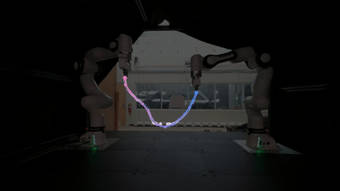
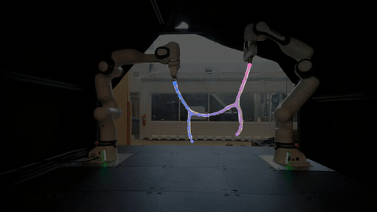
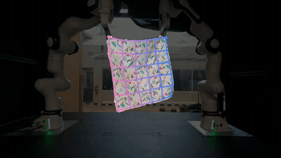
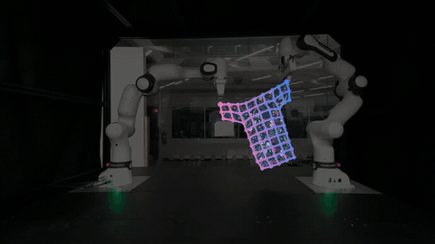
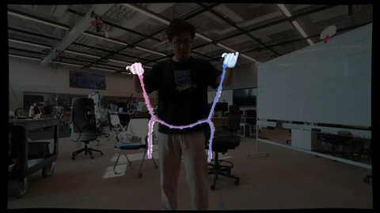
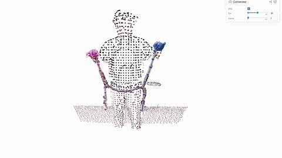

# TrackDeform3D: Markerless and Autonomous 3D Keypoint Tracking and Dataset Collection for Deformable Objects

Official implementation of TrackDeform3D — [arXiv:2603.17068](https://arxiv.org/abs/2603.17068)

Given RGB-D recordings of a deformable object, TrackDeform3D recovers a compact set of **3D keypoints with their topology (graph edges)** on the first frame and **tracks them consistently** through the whole recording — markerless, autonomous, and without object-specific training.

<table>
  <tr>
    <td align="center"><br/><b>DLO</b> (open-chain cable)</td>
    <td align="center"><br/><b>BDLO</b> (branched DLO)</td>
  </tr>
  <tr>
    <td align="center"><br/><b>Fabric</b> (rectangular cloth)</td>
    <td align="center"><br/><b>Cloth</b> (T-shirt)</td>
  </tr>
  <tr>
    <td align="center"><br/><b>Application:</b> hand-held branched rope</td>
    <td align="center"><br/><b>Application:</b> interactive 3D view (viser)</td>
  </tr>
</table>


---

## 1. Installation and Setup

### 1.1 TrackDeform3D (core trackers)

The four core trackers only need a small Python stack (tested with Python 3.11 on Linux):

```bash
conda create -n trackdeform3d python=3.11 -y
conda activate trackdeform3d
pip install -r requirements.txt
```

That is all you need for Section 2.

### 1.2 Hand-held application (HaMeR)

The hand-held rope application (Section 3) additionally uses [HaMeR](https://github.com/geopavlakos/hamer) for hand reconstruction. We arrange HaMeR as a third-party dependency **inside this repo** at `deform_with_hands/thirdparty/hamer`, and we recommend giving it **its own conda env** (its torch/detectron2 stack is heavy and should not be mixed with `trackdeform3d`):

```bash
cd deform_with_hands/thirdparty
git clone --recursive https://github.com/geopavlakos/hamer.git
conda create -n hamer python=3.10 -y
conda activate hamer
# then follow the official HaMeR installation instructions (pip install -e .[all],
# download the trained models into hamer/_DATA, and get the MANO model):
# https://github.com/geopavlakos/hamer
```

`deform_with_hands/run_pipeline.sh` orchestrates the two envs for you — HaMeR stages run in `hamer`, everything else in `trackdeform3d`. All paths are centralized in `deform_with_hands/paths.py`.

### 1.3 Sample data

All sample data (everything under `input_data/`) can be downloaded from
[Google Drive](https://drive.google.com/drive/folders/1emeePJieKG0wwYZt4PY1E7GW2_mIJVrk?usp=sharing).
Extract it so that `input_data/` sits at the repo root, next to the tracker scripts. It ships one example chunk per object — `dlo/chunk_1`, `bdlo/chunk_7`, `fabric/chunk_14`, `cloth/chunk_0` — plus the raw Kinect capture for the hand-held application (`deform_with_hands/`).

<details>
<summary><b>Data format</b> (click to expand)</summary>

Each tracker reads `input_data/<object>/chunk_<N>/`, with the rig calibration next to it:

```
input_data/
├── dlo/
│   ├── calibration/transform_ee_cam_world.npz    # T_left_base2cam, T_right_base2cam, K
│   └── chunk_<N>/
│       ├── rgbd.npz                              # color (T,H,W,3) uint8 BGR; depth (T,H,W) uint16 mm
│       ├── masks/masks.npz                       # key 'masks' — foreground mask
│       ├── left_arm_poses.npz                    # arr_0..arr_{T-1}: [x,y,z,qw,qx,qy,qz], base frame (m)
│       └── right_arm_poses.npz
├── bdlo/        same as dlo
├── fabric/      mask file is fg_mask.npz (key 'fg_mask')
├── cloth/       mask file is fg_masks/masks.npz (key 'masks')
└── deform_with_hands/
    ├── rgbd.npz                                  # 16 s Azure Kinect clip
    └── calibration.json
```

- `transform_ee_cam_world.npz` holds the two 4×4 robot-base→camera transforms and the 3×3 intrinsics `K`. Cloth and fabric share one rig calibration; DLO and BDLO each have their own.
- Masks are `{0,1}` on the object foreground.
- EE poses are 7-vectors `[x, y, z, qw, qx, qy, qz]` in the robot base frame, position in meters.
- To add more recordings, just drop new `chunk_<N>/` folders next to the shipped ones.

</details>

---

## 2. TrackDeform3D

All four trackers follow the same three-step recipe and share the loading / smoothing / metric / rendering scaffolding (`initialization/`, `tracker/`, `utils/`):

1. **Initialize** — recover the keypoints and their topology on the first frame from the object's foreground mask.
2. **Build correspondence with the EE** — match the object's anchor nodes (leaves / corners) to the robot end-effectors, so the tracker knows which node each gripper holds. Both anchoring modes are supported (the `_replace_with_ee_poses` pattern): keep anchor positions purely from the camera observation, or hard-replace the anchor nodes with the EE poses.
3. **Track** — per frame: segment the foreground point cloud, re-identify the anchor nodes, then refine all keypoints with a **Gauss-Seidel-style constrained optimization**: sequential edge-length passes interleaved with projection back onto the observed point cloud.

### 2.1 DLO

**Init:** skeletonize the frame-0 mask → sample `--n_keypoints` evenly along the skeleton path → connect into a chain, then relax with a repulsion pass. **EE correspondence:** the two chain ends are matched to the left/right grippers. **Track:** per-frame node identification on the new point cloud, then constrained optimization preserving the chain's segment lengths.

```bash
python dlo_tracking.py --chunk 1 --clip_seconds 10 --n_keypoints 15
```

### 2.2 BDLO (branched DLO)

**Init:** skeletonize → detect **branch and leaf nodes** from the skeleton graph → allocate keypoints per segment (`--keypoints_per_segment`, order `[ee0, ee1, free0, free1, trunk]`) → tree topology + repulsion relaxation. **EE correspondence:** two of the four leaves are matched to the grippers; the other two stay free. **Track:** branch/leaf nodes are re-identified every frame and matched to the previous frame with a Hungarian assignment (gated to reject jumps), then the whole tree is refined with the same edge-length + projection optimization.

```bash
# n_keypoints must equal 2 (branch nodes) + 4 (leaves) + sum(keypoints_per_segment)
python bdlo_tracking.py --chunk 7 --clip_seconds 10 --n_keypoints 25 \
    --keypoints_per_segment 4 4 3 3 5
```

### 2.3 Fabric (rectangular cloth)

**Init:** detect the four mask corners → span a regular grid between them (border nodes placed by farthest-point sampling) → repulsion relaxation on the surface. **EE correspondence:** the grasped corners are matched to the grippers. **Track:** per-frame corner re-identification, then grid optimization that preserves the grid edge lengths while snapping nodes onto the observed surface.

```bash
python fabric_tracking.py --chunk 14 --clip_seconds 10
```

### 2.4 Cloth (T-shirt)

**Init:** detect the garment's **8 contour corners** → fit the maximal inscribed rectangle for the interior grid and distribute `--segment_interior_nodes` along the contour between consecutive corners (traversal order C0→C1→…→C7→C0) → repulsion relaxation. **EE correspondence:** grasped corners ↔ grippers. **Track:** same anchor re-identification + constrained-optimization loop, NaN-hardened for nodes that leave the crop.

```bash
python cloth_tracking.py --chunk 0 --clip_seconds 10 \
    --segment_interior_nodes "1,1,5,3,5,1,1,7"
```

### Running the prepared scripts

The four commands above are bundled in [`run_all.sh`](run_all.sh):

```bash
conda activate trackdeform3d
bash run_all.sh
```

Results land in `output/<object>/chunk_<N>/clip_<i>/`: raw `3d_keypoints.npz`, `smoothed_3d_keypoints.npz` (Gaussian `--sigma`, video-only — metrics stay raw), an evaluation `summary.txt`, and the tracking video.


### Running time

Measured on one 10 s clip (300 frames at 30 fps), CPU only, on an AMD EPYC 7413 (24-core):

| Object | # keypoints | # edges | Running time |
| ------ | :---------: | :-----: | :----------: |
| DLO    | 15          | 14      | ~6 s         |
| BDLO   | 25          | 24      | ~25 s        |
| Fabric | 36          | 60      | ~90 s        |
| Cloth  | 81          | 96      | ~180 s       |

---

## 3. TrackDeform3D's Application: Tracking a Hand-Held Branched Rope

TrackDeform3D is not tied to robot grippers — any reliable end-effector signal works. In [`deform_with_hands/`](deform_with_hands/) we replace the robot EEs with **human hands reconstructed by HaMeR** and track a branched rope through a 16 s Azure Kinect capture clip, end to end:

```bash
cd deform_with_hands
bash run_pipeline.sh        # orchestrates both conda envs ($H = hamer, $T = trackdeform3d)
```

```bash
$H s1_run_hamer.py          # undistort (cached) + HaMeR -> aligned hands + EE
$T s2_postprocess_hands.py  # inpaint missing hands + smooth the EE trajectory
$T s3_get_mask.py           # {rope+hands+arms} DBSCAN -> remove hands -> remove arms
$T s4_tracking.py           # EE-anchored BDLO tracking -> output/tracking/
$H render_tracking.py       # -> output/tracking/clip_0/tracking_deform_with_hands.mp4
```

Every stage writes exactly one artifact into `deform_with_hands/output/`; see [`deform_with_hands/README.md`](deform_with_hands/README.md) for the per-stage details.

>  The raw capture is 30s. We start at 2 s to leave time for the person to enter the camera view. We stop at 18 s because right after that the depth camera fails for ~10 frames under the super dynamic motion, so the tracker would have no valid ground-truth depth / point cloud to track against.

We especially encourage you to explore the result in **interactive 3D** with [viser](https://viser.studio/main/) — the tracked rope, the reconstructed MANO hands, and the foreground point cloud, all in one scene you can orbit freely (this is how the 3D video above was recorded):

```bash
conda activate trackdeform3d
python deform_with_hands/viser_rope.py
```

---

## 4. FAQ and Experiences

We document thoughtful comments here together with some hands-on experience and hope they help you step into the project faster.

**Q1. How would you initialize keypoints for 2D objects with more complex topology (beyond rectangles and T-shirts)?**
We believe first-frame structure discovery for arbitrary 2D deformables is genuinely an **open question in computer vision and graphics**. A direction we find promising is to use pretrained vision models, for example RGB-to-mesh or RGB-D-to-mesh reconstruction works, to propose the initial keypoints and topology. That structure can then be handed to TrackDeform3D for consistent tracking, since the tracking stage is agnostic to where the frame-0 graph came from. If you try this, we would love to hear about it. Contributions are very welcome!

**Q2. Can the algorithm deal with BDLOs of different topologies?**
Yes. The tracker itself is topology-generic. What it needs from you is the topology specification: the **number of branch nodes**, the **neighbors of each branch node**, and the **number of leaf nodes**. The shipped configuration is the Y-shape (2 branch nodes, 4 leaves) from our example data. The initialization is parameterized by this specification, so adapting the code to a different BDLO topology should be straightforward.

**Q3. How is the target (reference) length defined?**
It is defined **at initialization**. From the overall length/size of the deformable object and the length of each segment measured on the first frame, we derive per-edge reference lengths (saved as `reference_lengths` in the output npz). During tracking these act as edge-length constraints in the optimization. This is what keeps the keypoint graph from stretching or collapsing as the object deforms.

**Q4. Any practical experience from making this work on the hand-held rope?**
A branched rope under human hands undergoes **much more dynamic motion** than under slow robot arms. Two things made the difference for us. The first is adding **safety gates** on the frame-to-frame anchor matching to reject implausible jumps. The second is using **node pruning** to find the exact branch node when a gate fires. This sacrifices some speed, but buys reliable anchor identification under fast motion, and we found the trade well worth it. For reference, tracking the 16 s clip at 30 fps takes ~270 s. For the details, check the tracking implementation in [`deform_with_hands/s4_tracking.py`](deform_with_hands/s4_tracking.py).

---

## 5. Acknowledgements

This work builds on and was inspired by:

- [DEFT](https://github.com/roahmlab/DEFT)
- [DEFORM](https://github.com/roahmlab/DEFORM)
- [Topology Matching of Branched Deformable Linear Objects](https://ieeexplore.ieee.org/abstract/document/10161483)
- [HaMeR](https://github.com/geopavlakos/hamer)
- [Viser](https://viser.studio/main/)

---

## 6. Citing

If you find TrackDeform3D useful in your work, please cite:

```bibtex
@article{zong2026trackdeform3d,
  title   = {TrackDeform3D: Markerless and Autonomous 3D Keypoint Tracking and Dataset Collection for Deformable Objects},
  author  = {Zong, Yeheng and Chen, Yizhou and Bowler, Alexander and Yang, Chia-Tung and Vasudevan, Ram},
  journal = {arXiv preprint arXiv:2603.17068},
  year    = {2026}
}
```
